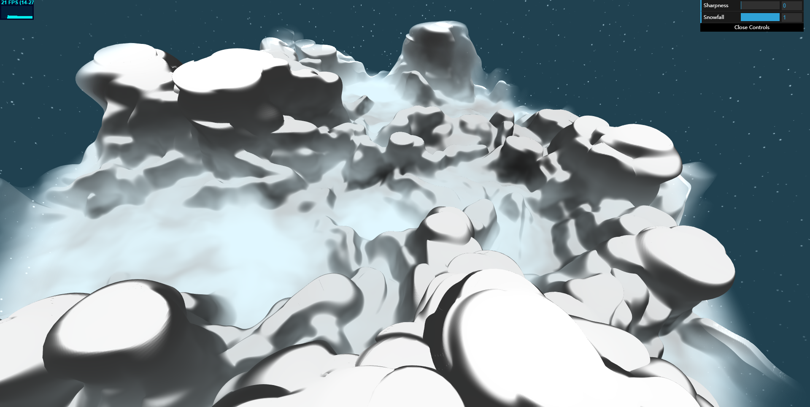
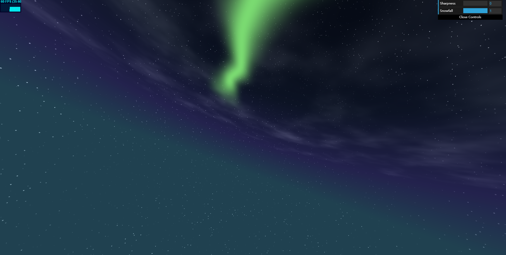

# Haoran Wei (82926501)

## External Resources
- [Aurora Video](http://www.antarctica.gov.au/about-antarctica/environment/atmosphere/aurora)
- [Perlin Noise](https://www.youtube.com/watch?v=MJ3bvCkHJtE)
- [Perturbed FBM](http://iquilezles.org/www/articles/warp/warp.htm)

## Demo
[Demo Page](http://whaoran0718.github.io/hw01-noisy-terrain)

## Techniques
### Terrain from Height Map
Use perturbed FBM-Perlin noise to get a basic height map 
and remap the map by using smoothstep to generate
flat and smooth basins among steep mountains.

### Deformation Based on Gradient
Calculate gradient for each vertex and bump out on xz plane along the projected direction of gradient.
The factor of deformation is from the amount of gradient and a 3D Worly noise which is compressed on z axis.
In addition, The factor is influenced by height map as well which shows a smooth deformation on bottom and
intensive on top. 

### Color Based on Height and Gradient
Transmit information of gradient from vertex shader to fragment shader by using the forth component of fs_Pos.
Flat area will collect more snow and there could be more snow on top. Draw white color where gradient is small 
and become grey when the height goes down.

### Flowing Noise Fog
Generate fog by 3D perturbed FBM-Perlin Noise and multiplies a height factor. Add time factor to the offset of
warp function. Changing primary offset causes micro-turbulence and secondary offset causes main flowing pattern.

### Sky Ramp
In fragment shader, get a ray from camera to pixel by inverse of view-project matrix. Dot product with world up vector
and change background color based on the value.

### Random Stars
Use wide-range Perlin noise to simulate the distribution of stars and use Worley noise to create stars.
Worley noise has been change by randomly add a small value on the final output distance and cut by smoothstep
to discard some stars randomly. This method looses the pattern of Worly noise and get a better starry.

### Cloud
Generate cloud by using perturbed FBM-Perlin noise with time factor. Sample points used in noise function
have been worked out by projecting points on view sphere to sky plane.

### Simple Dynamic Aurora
Create a line by using pulse funtion. Use perturbed Perlin noise to curve the aurora and use time factor to let
it flow and shake.

